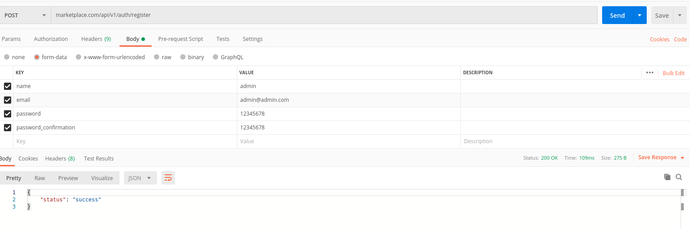

````
composer require tymon/jwt-auth
php artisan vendor:publish --provider="Tymon\JWTAuth\Providers\LaravelServiceProvider"
````
Check existing of ```config/jwt.php```
````
php artisan jwt:secret
````
Check ```.env```
````
cda
````
Change model User
````
<?php

namespace App;

use Tymon\JWTAuth\Contracts\JWTSubject;
use Illuminate\Notifications\Notifiable;
use Illuminate\Foundation\Auth\User as Authenticatable;

class User extends Authenticatable implements JWTSubject
{
    use Notifiable;

    // Rest omitted for brevity

    /**
     * Get the identifier that will be stored in the subject claim of the JWT.
     *
     * @return mixed
     */
    public function getJWTIdentifier()
    {
        return $this->getKey();
    }

    /**
     * Return a key value array, containing any custom claims to be added to the JWT.
     *
     * @return array
     */
    public function getJWTCustomClaims()
    {
        return [];
    }
}
````
## Configure Auth guard ```config/auth.php```
````
'defaults' => [
    'guard' => 'api',
    'passwords' => 'users',
],

...

'guards' => [
    'api' => [
        'driver' => 'jwt',
        'provider' => 'users',
    ],
],
````
## Create dir Model
Create the directory.

Move model User to the new directory.

Change model:
````
namespace App\Models;
````
Change ```config/auth.php```: 
````
'providers' => [
    'users' => [
        'driver' => 'eloquent',
        'model' => App\Models\User::class,
    ],
],
````
## Add some basic authentication routes
````
Route::prefix('v1')->group(function () {
    Route::prefix('auth')->group(function () {
        // Below mention routes are public, user can access those without any restriction.
        // Create New User
        Route::post('register', 'AuthController@register');
        // Login User
        Route::post('login', 'AuthController@login');

        // Refresh the JWT Token
        Route::get('refresh', 'AuthController@refresh');

        Route::get('me', 'AuthController@me');
        // Below mention routes are available only for the authenticated users.
        Route::middleware('auth:api')->group(function () {
            // Get user info
            // Logout user from application
            Route::post('logout', 'AuthController@logout');
        });
    });
});

````
## Create controller
````
php artisan make:controller AuthController
````
````
<?php

namespace App\Http\Controllers;

use Illuminate\Http\JsonResponse;
use Illuminate\Http\Request;
use Illuminate\Support\Facades\Validator;
use Illuminate\Support\Facades\Auth;
use App\Http\Controllers\Controller;
use App\Models\User;

class AuthController extends Controller
{
    /**
     * Register a new user
     *
     * @param Request $request
     *
     * @return JsonResponse
     */
    public function register(Request $request)
    {
        $v = Validator::make($request->all(), [
            'name' => 'required|min:3',
            'email' => 'required|email|unique:users',
            'password'  => 'required|min:3|confirmed',
        ]);
        if ($v->fails())
        {
            return response()->json([
                'status' => 'error',
                'errors' => $v->errors()
            ], 422);
        }
        $user = new User();
        $user->name = $request->name;
        $user->email = $request->email;
        $user->password = bcrypt($request->password);
        $user->save();
        return response()->json(['status' => 'success'], 200);
    }

    /**
     * Login user and return a token
     *
     * @param Request $request
     *
     * @return JsonResponse
     */
    public function login(Request $request)
    {
        $credentials = $request->only('email', 'password');
        if (! $token = auth()->attempt($credentials)) {
            return response()->json(['error' => 'Unauthorized'], 401);
        }

        return $this->respondWithToken($token);
    }

    /**
     * Get the token array structure.
     *
     * @param  string $token
     *
     * @return JsonResponse
     */
    protected function respondWithToken($token)
    {
        return response()->json([
            'access_token' => $token,
            'token_type' => 'bearer',
            'expires_in' => auth()->factory()->getTTL() * 60
        ]);
    }

    /**
     * Logout User
     */
    public function logout()
    {
        auth()->logout();

        return response()->json(['message' => 'Successfully logged out']);
    }
    /**
     * Get authenticated user
     */
    public function me()
    {
        return response()->json(auth()->user());
    }

    /**
     * Refresh a token.
     *
     * @return JsonResponse
     */
    public function refresh()
    {
        return $this->respondWithToken(auth()->refresh());
    }
}
````
## Test with Postman



Logout: with headers, without body.
